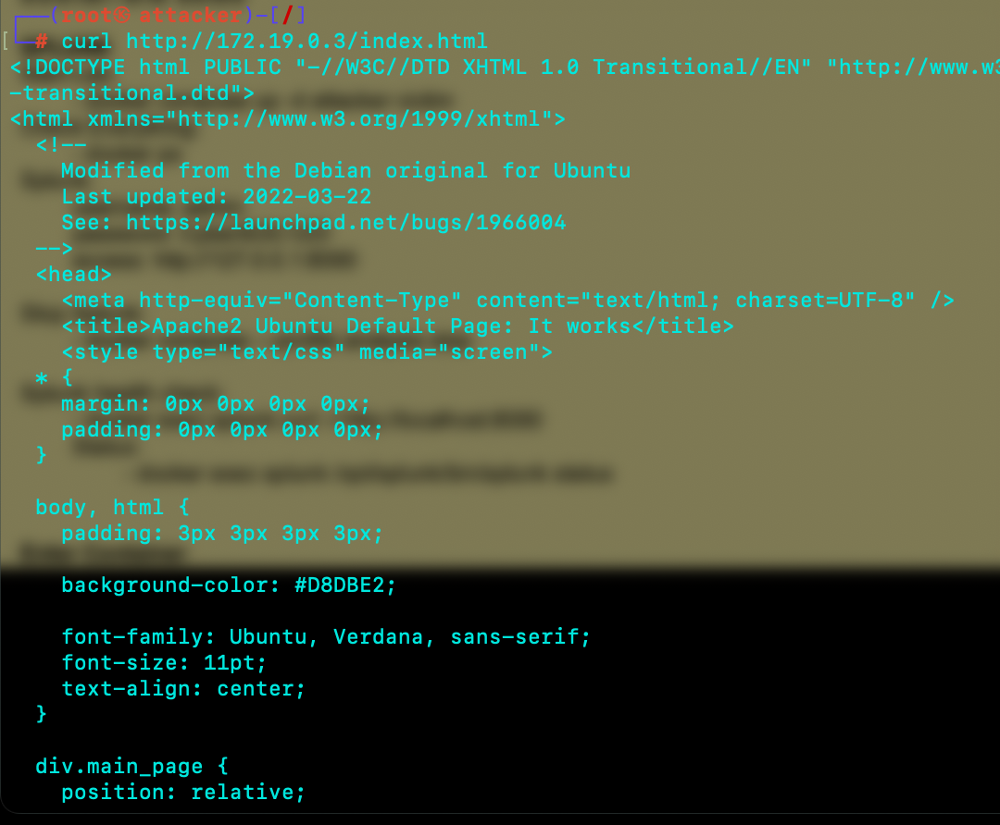

# Investigation#3 - Gobuster Directory Enumeration

Conducting gobuster attack to the victim-server to learn the behavior of the attack.

To Investigate im using splunk run in my lab environment using docker.

!!! everything conducted in a controlled lab environment.

- Gobuster

    Gobuster is a directory enumeration attack, using bruteforce as the method to search directory of a web.
    It works by sending http request for each wordlist and observe the response code.

    to do this attack, we need a wordlist that i obtain from seclist.

    command: 

    gobuster dir -u http//:victim -w wordlist

    

    From the screenshot the directory that i obtained from the victim-server is:

    - .htaccess [403] -> File exist, block access
    - .htpasswd [403] -> File exist, block access
    - .hta [403] -> File exist, block access
    - index.html [200] -> Accesible
    - server-status [403] -> File exist, block access

    To check the content im using curl:

    - 403 status
        
        
        
        access blocked
    
    - 200 status
        
        

        we could see the page source for code 200

for the investigation im using splunk to see the logs of the activity. My goal here is to recognize the gobuster directory enumeration from the starting point.

- Investigation

    Recoinassance phase often starting from nmap(network enumeration). Threat actor usually did this to find open ports.

    - The pattern of nmap on splunk logs:
    

    and if the threat actor find http ports are open, gobuster is one of the tools to find a directory.

    gobuster is using brute force method. so, there will be many unusual http request using multiple words.
    - The pattern of gobuster on splunk logs:
    
    

    There's multiple get request using different names and showing different status code.

    the pattern of the logs is:
    - "GET /~adm HTTP/1.1" 404 433 "-" "gobuster/3.8.2"
    ->client sending http GET request to /~adm endpoint and the status is 404(resource not found).
    - "gobuster/3.8.2" -> this could not be used as an indicator because it could be hide by an attacker.

# Conclusion

Because gobuster using brute force method, the way to recognized this attack is to see a big numbers of an unusual GET request using multiple endpoint names within a seconds.
