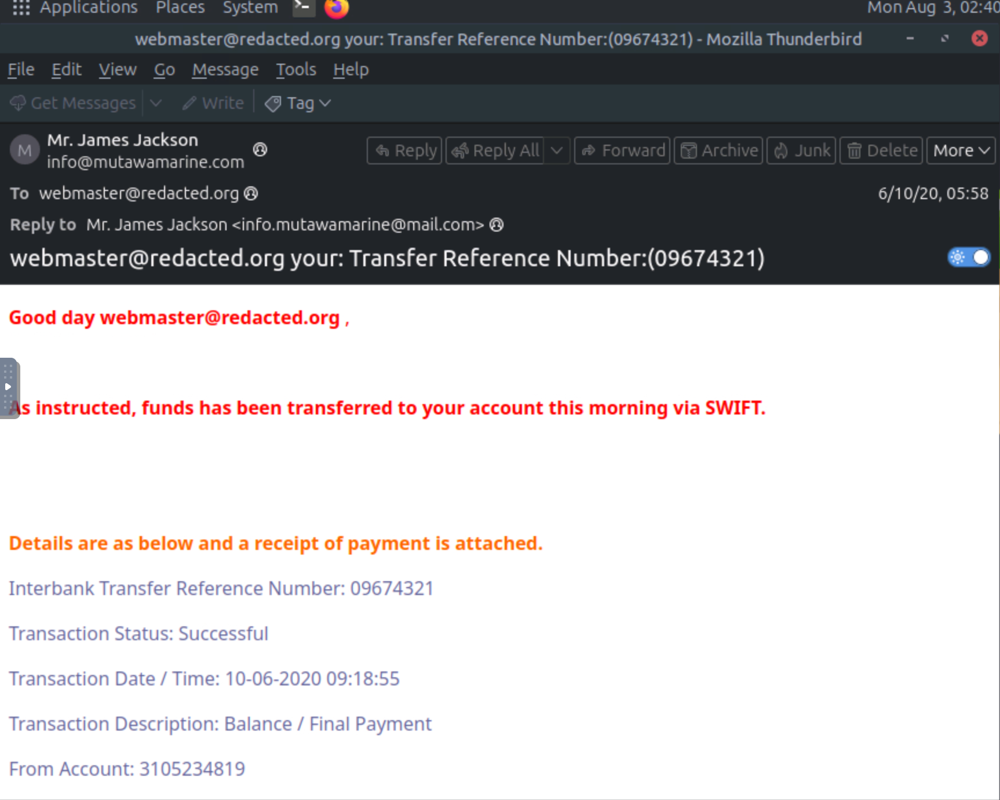

# The Green Holt phish 

here's the investigation of phishing email challenge on try hack me

step. 1 i open the file named challenge.eml
and here's what i found

 

step.2 when checking to suspicious email, is great to start from the header. we could get information from the email header. such as sender's email, display name, subject.

1. what is the Transfer Reference Number?

    by looking at the email header, we can see that the transfer reference number is [09674321].

2. What is the display name of the sender?

    the display name of the sender is Mr. James Jackson.

3. What is the sender's email address?

    looking at the header the sender's email address is info@mutawamarine.com

4. What email address will receive a reply to this email?

    we could find this by looking at the reply to section on the email header. and the answer is info.mutawamarine@mail.com

step.3 after we gather information from the header and we find the information about the sender and what the email is about, now we could investigate the email source. the email is formatted on html so by looking at the source code, we could gather more information.

here's to view the source code from the email.

now we could gather more information about the email

5. What is the originating IP address of this email?

    

    from that screenshot. the originating IP Address is 192.119.71.157.

    but why not the 10.197.41.148? because i think that is a private IP Address that the email host is using. so from my understanding, private ip range are :

        - 10.0.0.0 - 10.255.255.255
        - 172.16.0.0 - 172.31.255.255
        - 192.168.0.0 - 192.168.255.255

    then, the 10.197.41.148 is within the range of a private IP Address.

6. Who is the owner of the originating IP?

    to investigate this im using online tool on the internet called whois and inserting the originating IP Address that i just found. and here's what i found.

    

    form that screenshot i could get information about origin name, id, address, city, and other stuff.

    so the answer for this question is HostPapa.

step.4 we need to check the SPF record to answer this question "Was this email sent from a mail server that the domain owner actually authorized?"

for example if the email sent from support@microsoft.com just because it sent from microsoft.com doesnt really meand its from microsoft. that's why spf checking is useful.

7. What is the full SPF record for this domain?

    to answer this question im using only SPF record tools called MX toolbox.

    

    im using the return-path information and check it using MX toolbox

    and here's what i found

    

    the answer for this question is 
    v=spf1 include:spf.protection.outlook.com -all

    let's breakdown the spf record:
    - v=spf1 -> this spf version 1 record
    - include:spf.protection.outlook.com -> this are the mail server that is allowed to send the messages.
    - -all -> mail that sent from server that are not authorized by SPF policy should fail the spf validation.

step.5 investigate DMARC(domain based-message authentication). DMARC is authentication protocol to protect domains from spoofing and phishing. 

8. What is the complete DMARC record for this domain?

    to check DMARC record im using online tool called MX toolbox.

    and here's what i found

    

    the answer is v=DMARC1; p=quarantine; fo=1

    by the screenshot we know DMARC works like "what the mail servers would do if SPF and DKIM fail?"

    and we can see the description of the DMARC record. 

    breakdown:
    - v=DMARC1 -> DMARC version 1.
    - p=quarantine -> the email that fails goes to quarantine. meaning it is suspicious
    - fo=1 -> requests that forensic failure reports be generated whenever either SPF or DKIM authentication fails, providing additional visibility into authentication failures.

step.6 investigate the email attachment. 

9. What is the file name of the attachment found in the email?

    the answer is SWT_#09674321____PDF__.CAB

step.7 to investigate the attachment file, first we need to get the information about the hash values of the file. im using terminal and the command "sha256sum" 

and we got the hash values. and when we got the hash values we could check if its known malicious by using online tools like virustotal.

here's what i found 

and its indicate that the hash values of the file is malicious.

10. Using the sha256sum command, what is the SHA256 hash of the file?
    
    the answer is
    2e91c533615a9bb8929ac4bb76707b2444597ce063d84a4b33525e25074fff3f

11. What is the attachment's file size in KB (e.g., 122.31 KB)?

    400.26 KB

and when we investigate it further

we know the the actual file is rar

12. what is the actual file extension?
    
    the answer is
    rar

CONCLUSION :

- to investigate phishing email first check the header, phishing is a social engineering threat that is usually works by manipulating the victim psychology. on phishing email most of the time the threat actor is creating sense of urgency on the message. we could gather informations like the sender display name, email, and who could reply. 
check for typosquatting.
example : youtube.com -> y0utube.com

- check email source. we could gather more information by looking at the email source. there's an IP Address that we could check using online tools, attachment files name and extension that is used. also if the email got an embeded URLs we could check it using this before clicking it. 

- review the SPF record. SPF record is to authenticate the sender of an email. so by looking at this record and compare it to online tools that we use to lookup the IP Address, we could gather information whether the record and whois result is align or not.

- review the DMARC record. to check what the mail server do if SPF and DKIM fail. the important part in this is the p=none, p=quarantine, p=reject.

and we could flag it one by one to see if the email legit or not. 