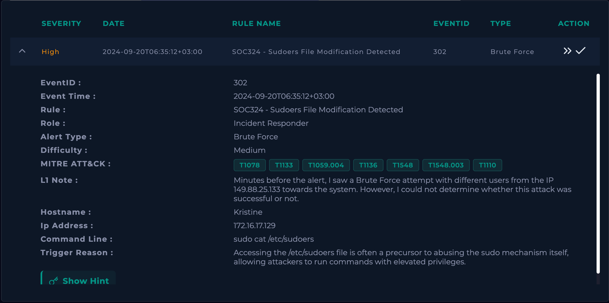

# LetsDefend - SOC Practice

practice analyzing report, log, and identified malicious activity. using LetsDefend website.

this practice start from medium leve to hard level

# Case 1

we could gather information by looking at this screenshot. my goal here is to collect as much IOC that can be useful later.

- Artifact : 
    - IP Address -> 172.16.17.132
    - Hash Values -> 269908E1B76AFAF1D837BCE28640A1066808AAAC29E6BC6575581DCC907065D0 (SHA256)
    - Sender Email Address -> pavlodar.news@bk.ru
    - Sender IP -> 91.195.240.94
    - File Attachment -> 2024 Financial Report.exe
    - File Path -> C:\Users\LetsDefend\Downloads\2024-financial-report\2024 Financial Report.exe

now, im using online tools to check this artifact. i start from the IP address.
 - IP Address Checking
    
    

    this information works to give me a little bit of context about the IP. but, there is no geolocation information/hosting that can be useful.

    Private IP range : 
     - 10.0.0.0/8
     - 172.16.0.0/12
     - 192.168.0.0/16
    
    so, this is a private IPv4 address

- Hash Values Cheking 

    im using VirusTotal to check the hash values, and here's what i found
    

    now, this is useful because we know the type of the attack, threat categories, family labels, and the community score.

    from VirusTotal this file are definately malicious.

    and to get more information im checking the details section. 
    

- Sender email address

    im using whois to check sender email address to more context.
    

    this is a long established domain, not newly registered.

- File Attachment

    Based on VirusTotal checking, this file are malicious
    

    however this file are looks suspicious before the VirusTotal checking because, it presented as a financial report but using .exe file extension.

    normally report are in pdf, xlsx, xlsb(binary), xls(legacy)

    another suspicious file extension in report is .xlsm because it contains macros. but, .xlsm is still a legitimate excel file format, so it does not really indicate that the file is malicious.

- File Path Checking 

    C:\Users\LetsDefend\Downloads\2024-financial-report\2024 Financial Report.exe

    so the file are in downloads directory. meaning the user already download it and now the file is running on the disk. 

    VirusTotal indicated that this file are malicious.\

- Logs Investigation
    im using the source IP to gather the log information
    and here's what i found.

    
    
    

    download event from files-ld.s3.us-east-2.amazonaws.com immediately before the creation and execution of 2024 Financial Report.exe. chrome activity was seen at 09:51:42, followed by file creation at 09:52:14 and process execution shortly after that. the sequence supports that the malicious executable was delivered through a web-based download.

    Evidence : 
    - Malicious File
    - Categories: Trojan, downloader
    - Initial acces: Phishing
    - The Malware been executed 
    - Techniques: T1204.002-user execution
    
so next move is to remove the malicious artifact. on letsDefend they given me windows virtual machine. im navigating to C:\Users\LetsDefend\Downloads\2024-financial-report\2024 Financial Report.exe and using the del command to delete the exe files.

Report: 
Alert was investigated as suspected Zebrocy malware activity. The investigation identified a suspicious executable, "2024 Financial Report.exe", associated with the SHA-256 hash [hash]. The file was downloaded to the affected host and subsequently created and executed.

Threat intelligence confirmed the file as malicious, with 49/70 security vendors detecting the hash as malicious. The sender domain was also investigated, although the domain itself was long-established and this alone did not indicate malicious activity.

Log correlation showed the sequence of download, file creation, process creation, and execution. The activity was determined to be consistent with phishing followed by user execution of a malicious file.

No confirmed C2 address associated with the malware was accessed. The malicious executable was removed from the affected endpoint and deletion was verified.

Verdict: True Positive.

- Lessons

    - How did the cyber attack happen?
    - How well did staff and management perform in dealing with the incident?
    - What would the staff and management do differently the next time a similar incident occurs?
    - What corrective actions can prevent similar incidents in the future?
    - What precursors or indicators should be watched for in the future to detect similar incidents?

# Case 2

the name of alert is Forced Authentication Detected and this is a web attack type.

my first move is to gather much information by looking at this logs.
- Artifact:
    - Host = WebServer_Test
    - Source IP = 120.48.36.175
    - Request URL = hxxp[://]test-frontend[.]letsdefend [.]io/accounts/login
    - Destination IP = 104.26.15.61
    - MITE = T1187 - Forced Authentication

from that logs the request method are multiple POST request from the same IP to the fixed URI.

now im trying to investigate this event and collecting evidence whether the attempt succesful or not.

- Investigation

    - Evidence 1 - Brute Force Attempt

        im using log management on letsDefend, and here's what i found

        

        there's multiple network connection sends by the same Source IP to the same Destination IP across multiple destination port in the same time windows. But, most connection attempt were denied by firewall while traffic to port 80 were permitted.

        this behavior are consistent with brute force authentication attempt.

    - Evidence 2 - Authentication Status
        
        i need to find evidence whether the login attempt sucessful or not.

        im investigating the log management again and find the source IP traffic stop here.
        

        and the words admin are little bit concerning so im checking the action status on this logs. and here's what i found.

        

        and now the evidence is complete.

- Evidence
    - Multiple POST request to the same destination IP 
    

    - Time windows are indicated that this is a brute force attempt
    

    - The login attempt is succesful with username admin.

- REPORT 
    
    Verdict: TRUE POSITIVE

    Report:
    At 2023-12-12T14:15:00+03:00, Source IP 120.48.36.175 sending multiple traffic to the same destination IP 104.26.15.61 across multiple destination port in a small time windows. The authentication attempt are succesful for the admin account. This action needs escalation due to unauthorized access to a privileged account.

# Case 3

this case alerting a potentially malicious process started from shortcut.

my first move is to collecting information based on the logs.

- Artifact 
    - Hostname = Jesse
    - File Hash = 87E0B52EFF04E28BC5B041592D628A3500B147DD8E2164642B00D4A6602CD45A
    - File Name = Report Jul 14 47787.lnk
    - File Path = D:\Report Jul 14 47787.lnk
    - IP address = 172.16.17.104 - Private IP address
    
    L1 notes = "Minutes before the alert, Jesse received an e-mail containing a URL. Clicking on the link in the e-mail downloads the file 'Release_July.zip'. However, I could not detect the connection between the file and the 'Report Jul 14 14198.lnk' shortcut."

    from the notes we know that the file are gathered from email with name "Release_July.zip"

- Investigation

    - Evidence 1 - Threat Intel Report 

        to create more context about the information that we had, im using online tools to check the file hash.
        and here's what i found 
        
        
        

        information that we obtained based on online threat intel is the file Report Jul 14 47787.lnk are malicious. with trojan categories.

    - .lnk File Extension

        .lnk file is a shortcut or local link used by Microsoft Windows to point to an original program, file, folder, or network drive. Windows hides this file extension by default and displays a small curved arrow on the icon. Double-clicking it opens the target item directly

    - Log Management Investigation around 12:22:18+03:00

        to investigating the log, im gonna use IP 172.16.17.104. This is a private IP address belong to Host Jesse.

        my goal here is to get the connection between file 'Release_July.zip' to 'Report Jul 14 47787.lnk'.

        - Evidence 2 - 'Release_July.zip downloaded over HTTPS.
        and i found this related to 'Relese_July.zip'
        

        - URL: hxxps://files-ld.s3.us-east-2.amazonaws.com/static/Release_July.zip - Evidence 2
        - Destination IP: 3.5.129.112
        - Port: 443
        - Timestamp: 2023-12-04 16:20:10
        - Action: Permitted

        we find evidence that jesse downloaded 'Release_July.zip' over HTTPS.

        - Evidence 3 - 'Release July' spawning 'Report Jul 14 47787.iso'

            and the next log are this
            

            Report Jul 14 47787.iso file was created after Relese_July.zip downloaded.

            and for me this is a red flag because .iso file extension is uncommon for a reporting file.

            
            - Notes .iso File Extension !
            
                iso file is a single digital image file that copies every exact bit, sector, and file structure from an optical disc like a CD, DVD, or Blu-ray"

        - Evidence 4 - wermgr.exe requesting hxxps://69.14.172.24/t4

            
            
            
            

            this is a potential C2 communication

            so, the behavior of this attack are:
            - .iso file -> calc.exe -> regsvr32.exe -> wermgr.exe -> hxxps://69.14.172.24/t4

        - Notes REGSVR32.EXE

            REGSVR32.EXE is a living of the land binary(LOLBin) it could be used for
            - Execute malicious DLLs
            - Download or execute remote scripts
            - Bypass application controls

        - Evidence 5 - Confirming Malicious Activity
        
            to get more evidence about the malicious avtivity. im cheking the hxxps://69.14.172.24/t4 on online threat intel. and here's what i found.

            

            hxxps://69.14.172.24/t4 is malicious based on threat intelligence report.

- Report 

Verdict: True Positive

Report: 

At 2023-12-04T12:22:18+03:00, IP 172.16.17.104 with Host name Jesse reveiced email containing 'Release_July.zip'. After the investigation, 'Release_July.zip' are downloaded over HTTPS and it created 'Jul 14 47787.iso' file. This is the connection between the .zip and .lnk file. because iso is just a container file that holds file system layout, so it possible that .iso containing .lnk file.

After 'Jul 14 47787.iso' was created it spawned calc.exe to regsvr32.exe to wermgr.exe. Next wermgr.exe are requesting connection to hxxps://69.14.172.24/t4.

this behavior indicated an attempe for a C2 communication. Based on threat intel the hxxps://69.14.172.24/t4 are malicious.

Remediation: 
- Immediate containment: 
    - isolate the affected host
    - terminate the malicious process chain
    - block outbound communication
    - remove malicious artifact such .zip, .iso, .lnk
- Eradication:
    - Remove everything related to the malware
- Network remediation: 
    - block 69.14.172.24 at firewall, proxy, EDR
    - t4 endpoint need to add to blocklist
    - domain/ip add to threat intel blocklist

# Case 4

for this case the alert says "Powershell Encoded Command Detected"

first thing im gonna do is to get as many information by looking at the logs.

- Artifact:
    - Hostname: Hilary
    - IP Address: 172.16.17.197 - IPv4 - Private - Hilary
    - Process Name: powershell.exe
    - Command Line: C:\Windows\System32\WindowsPowerShell\v1.0\powershell.exe" -command "$codigo = '...';$oWjuxd = [system.Text.encoding]::Unicode.GetString([system.convert]::Frombase64string( $codigo.replace('DgTre','A') ));powershell.exe -windowstyle hidden -executionpolicy bypass -Noprofile -command $OWjuxD"
    - Sender Email: support@analogydispatch.top
    - L1 Notes: "
    I saw an encoded PowerShell command being executed on the user's host. However, I could not understand what was intended with these commands."
    - MITRE: T1059.001, T1059.005 - Command and Scripting Interpreter: Visual Basic

Before jumping to the deep investigation, im gonna check artifact using online threat intelligence tools.

the artifacts that we could use for this stage is the sender's domain which is "analogydispatch.top"

- Evidence 1 - Online Threat Intelligence
    

    The sender's domain is red flagged based on VirusTotal checking. This is domain are indicated as phishing domain.

so it's confirming the attack.

im gonna start the investigation, the goal in this stage is to find the chain of the attack. Also, i need to check whether this phishing attack is infected another device.

- Investigation

    the investigation start by checking the log management. Im using this IP 172.16.17.197 as a base for investigation around the time of the alert.

    - Evidence 1 - Suspicious Command Line - Log Management
        
        When investigating the log management, i find an interesting command line.

        

        !Command Line: C:\Windows\System32\WScript.exe "C:\Users\LetsDefend\Downloads\patch\patch.vbs"

        Wscript.exe is a legitimate windows script host executables. but it's executing .vbs script

        - !!! VBScript could execute commands directly on the operating system. and it's frequently use to spread malware.
        
        so i found this command line is a red flag.

    - Evidence 2 - Chain of the Attack - Log Management

        and the action before the VBScript file was spawned is this 

        

        patch.zip:Zone.Identifier was spawned at the Downloads directory.

        

        then, chrome.exe is downloading patch.zip

        and C:\Windows\System32\WScript.exe "C:\Users\LetsDefend\Downloads\patch\patch.vbs" this command line happened.

        and it leads to 
        

        the powershell command line.

    - Evidence 3 - Intention of Command Line - Log Management

        to see the intention behind the command line, im going so see what happen after the first command line.

        here's more command line after the first command line

        

        "DownloadDataFromLinks" is used to download data from two image URLs.

        it ends with Contact 541.93.321.39

        so powerShell script downloads image files from an external image-hosting service, indicating an attempt to retrieve a concealed payload from remote infrastructure.

        this behavior is consistent with command and control behavior.
    
    - Checking if there's is the same email that come from "nalogydispatch.top" 

        im using LetsDefend email security section to check email that come from this domain 
        
        and here's what i found.

        

        so, this domain only sending the email to 
        hilary[.]@letsdefend.io with attachment 'patch.zip'

        

- Report

    Verdict: True Positive

    Report: 

    On 2024-03-26 09:24 (+03:00), the host Hilary (172.16.17.197) executed an obfuscated PowerShell command shortly after a phishing email was received from support[.]@analogydispatch.top. The investigation identified a malicious execution chain involving a downloaded archive (patch.zip), a VBScript launcher (patch.vbs), an obfuscated PowerShell payload, and outbound communication with attacker-controlled infrastructure.

    The activity indicates a successful phishing-based malware execution with fileless PowerShell techniques.

    The malware was successfully executed on the endpoint. Evidence shows payload deobfuscation, in-memory execution, and outbound network communication, indicating that the endpoint was likely compromised.

- Remediation

    - Isolate the affected endpoint from the network.
    - Terminate malicious powershell.exe and wscript.exe processes.
    - Remove patch.zip and patch.vbs from the Downloads directory.
    - Block the identified malicious domains/IPs at network security controls.
    - Reset credentials if compromise is suspected.
    - Perform a full endpoint malware scan and 
    - investigate for persistence mechanisms.
            
# Case 5

    
in this case, the alert trigger is sudoers file modificiation detected.

sudoers file modification is the process of changing the /etc/sudoers file or adding files to /etc/sudoers.d/ on Unix-like systems.

first move is to collecting artifact based on the logs.

- Collecting IOC

    - Hostname: Kristine
    - IP Address: 172.16.17.129 - IPv4 - Private
    - Alert Type: Brute Force
    - L1 notes: "I saw a Brute Force attempt with different users from the IP 149.88.25.133 towards the system."
    - Command Line: sudo cat /etc/sudoers -> Read sudoers file in etc directory with admin privileges.

The attack is already happen, and i need to determine whether this attack was succesful or not.

to determine the completion of an attack, im using log management to investigate the IP given by L1 149.88.25.133.

before going to investigation, i need to confirm this is an actual attack from suspicious IP.

- Evidence 1 - Threat Intelligence Result
    
    Im using VirusTotal and AbuseIPDB to check the IP given by the L1. and here's is the result

    

    

    based on this result it indicates that IP is suspicious
- Investigation
    
    This investigation will using the LetsDefend log management. My starting point is to see the log activity from 149.88.25.133.

    The goal here is to determine the completion of an attack, see the behavior, and cheking if this IP is also attacking another device.

    - Evidence 2 - Brute Force Attempt - Log Management   

        
        

        based on this log, this is confirming a brute force attack.
        IP 149.88.25.133  initiated multiple attempts againts internal host 172.16.17.129 on TCP port 22(SSH). Multiple failed login attempt indicating the brute force is targeting user credentials.

    -   Evidence 3 - Brute Force Succes - Log Management

        the latest logs from this IP is Accepted password

        

        now we have prove that brute force attempt by IP 149.88.25.133 to IP 172.16.17.129 via SSH are succesful.

    The brute force attempt are succesful. now, im investigating the log from IP 172.16.17.129.

    - Evidence 4 - Audit Log - Log Management

        I found an interesting log sequence here,

        
        
        
        

        this is an audit log based on terminal command. based on this log the command sqequence are: 

        - sudo useradd -m letsdefend1 --> creating a new user letsdefend1
        - sudo psswd letsdefend1 --> set the password or changed password
        - sudo cat /etc/sudoers --> read the /etc/sudoers file
        - sudo visudo --> edit sudoers file  

        based on this command, sudoers file has been viewed and opened. It's indicating an attempt or review sudo privileges.

    to determine the impact of the attack, im doing investigation on Kristine - endpoint.

    - Evidence 5 - Full Command Sequence - Endpoint Security

    

    command analysis: 
    - groups letdefend1 --> confirming whether user belongs to privileged group
    - getent passwd --> for enumerate local user

- Report

    Verdict: TRUE POSITIVE

    Report: 

    At 2024-09-20T06:35:12+03:00, IP 149.88.25.133 performed credentials brute force attempt to IP 172.16.17.129 via SSH. The attempt is succesful, attacker creating a new user named letsdefend1 and manage to viewed /etc/sudoers file. 
    the command sudo visudo is confirming that the attacker has access the sudoers configuration through visudo. later, the command groups letsdefend1 and getent passwd confirming of discovery phase of an attack.

- Remediation
    
    4 Phase: 
    - Containment --> stop attack from spreading -> block the malicious source IP address 149.88.25.133 at the firewall or IDS/IPS. terminate any active SSH sessions associated with the attacker.

    - Eradication --> remove access or malware --> reset password of compromised letsdefende1 account

    - Recovery --> restore normal operations safely --> re enable connection and confirming that only authorized user could have privileges

    - Hardening --> prevent the same attack --> enable SSH key authentication

    
        